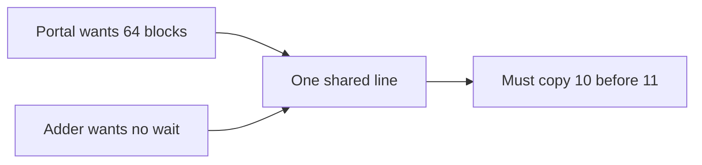
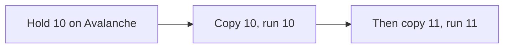
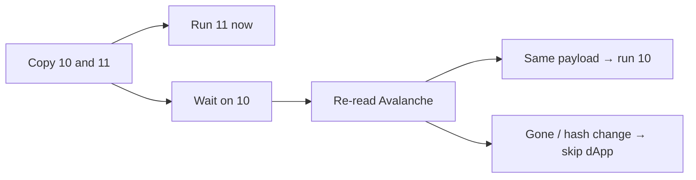
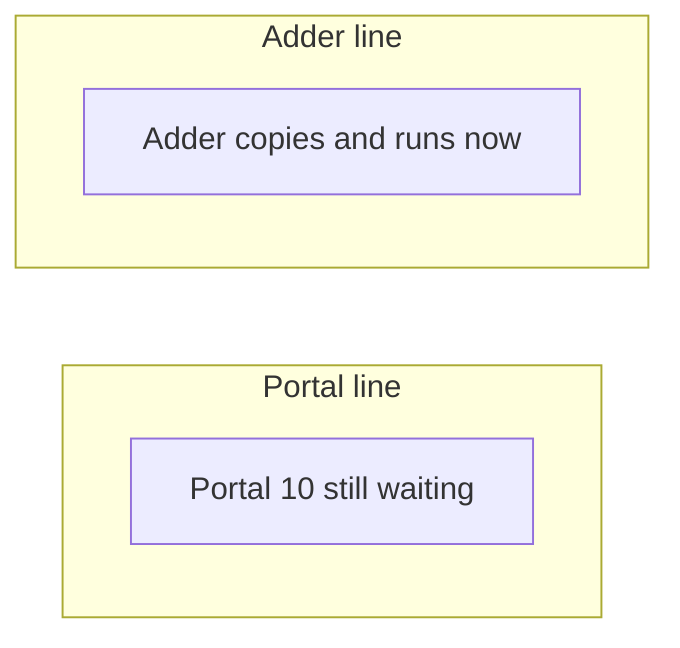
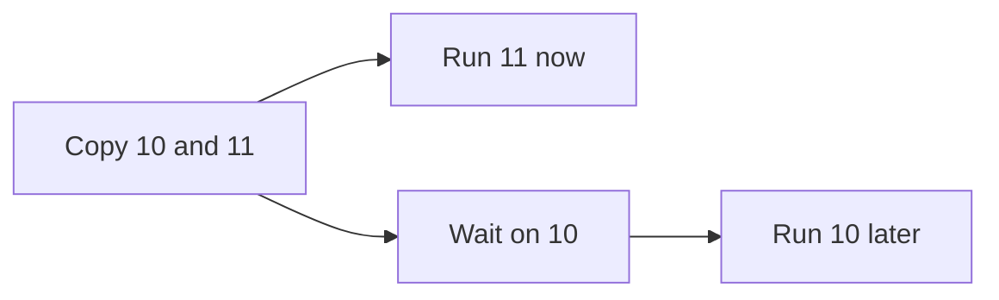
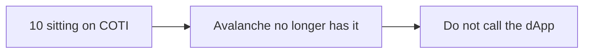

# PoD Inbox: waiting for source finality

**Status:** stakeholder decision memo. Not a ship plan and not a protocol change.

**Question:** how does a cautious dApp wait for Avalanche confirmations without freezing every other app on the same path to COTI?

---

## The problem

`batchProcessRequests` copies a request onto the destination **and** calls the dApp in the same transaction.

If the source chain (Avalanche) reorgs after that, the destination (COTI) has already executed something the source no longer has.

NBE already waits ~16 blocks (`NETWORK_BLOCK_SAFETY`) before mining. That wait is **global**. It holds the contiguous nonce cursor for the whole chain pair, not for one app.

---

## Today

Avalanche → COTI is **one numbered line**. Message 10 must be copied before message 11.

Privacy Portal and the adder **share** that line:

- inbound: `lastIncomingRequestId[sourceChain]`
- outbound: nonce per target chain

If Portal’s message 10 is held for confirmations, **anyone behind 10 waits too**.

---

## Three options

### 1. Wait, then copy

Do not copy message 10 until the source is deep enough. Then mine and execute as today.

| Helps | Hurts |
| --- | --- |
| Simple | Anyone behind 10 waits — including the adder |
| Order stays 10 then 11 | Whole chain pair is blocked, not just that app |
| No extra destination transaction | |

Use this if execute order must stay 10 then 11 and a shared wait is acceptable. Today’s NBE wait is already this, applied to everyone.

---

### 2. Copy now, run later (queue)

Copy 10 and 11 immediately so the line can move. Run 11 now. Run 10 only after the source still has the **same payload**.

| Helps | Hurts |
| --- | --- |
| Adder is not blocked | **11 may run before 10** |
| Recheck happens when the wait is over | Extra destination transaction |
| Keeps today’s request IDs | New miner loop, inbox size, ABI |

If the re-read is missing or the hash changed: mark **Reorged**, do **not** call the dApp. Two-way auto-raise; `ERROR_CODE_REORG` (5); not retryable.

Use this if the pain is “this message already landed on COTI but Avalanche reorged,” and mixed execute order is acceptable.

---

### 3. One line per dApp

Nonce per **source contract** (calling contract), not per user.

Portal has its own numbers. Adder has its own. They no longer share a cursor.

| Helps | Hurts |
| --- | --- |
| Portal waiting does not freeze the adder | Two Portal sends still share Portal’s line |
| Direct fix for product isolation | Does not, by itself, recheck after copy |
| | Breaking: request IDs, `getRequests(chain, from, len)` as one array, miner, likely remount |
| | Griefing via many contracts |

Per-**user** (`originalSender`) would explode cardinality. That is not the default reading of this option.

Use this if the pain is Portal vs adder (or any two products sharing a chain pair).

---

## Walk-through of option 2

Avalanche → COTI. Last copied number is **9**. Message **10** wants 64 Avalanche blocks. Message **11** wants none.

### Happy path

| Step | What happens |
| --- | --- |
| 1. Send | dApp sends 10 (wait 64) then 11 (no wait) on Avalanche. |
| 2. Copy | Miner copies both to COTI in order. The line moves: 9 → 10 → 11. |
| 3. Run 11 | COTI calls the dApp for 11 immediately. |
| 4. Wait | 10 sits on COTI unused until Avalanche is 64 blocks deeper. |
| 5. Check | Miner reads Avalanche. Same payload still there. |
| 6. Run 10 | COTI calls the dApp for 10. The dApp saw **11 first, then 10**. |

### If Avalanche reorged

Same first four steps. At step 5 the row is missing or the bytes changed.

COTI does **not** call the dApp. If the message was two-way, it sends an error back so Avalanche is not left hanging.

### Same sends, but wait-then-copy instead

10 is not copied until 64 blocks pass. 11 cannot be copied either. The adder (or any later number) waits the whole time.

Copy-now-run-later keeps the numbered line moving. It does **not** keep callback order. Apps that need 10 to run before 11 should wait on every send, or use a separate line per dApp.

---

## How to combine

| Mix | What you get |
| --- | --- |
| **(3) + (1)** | Only that product waits before mine. Adder is free. Portal’s own next send still waits. |
| **(3) + (2)** | Products are isolated **and** the same app can mix delayed and fast sends. |
| **(2) alone** | Keep today’s IDs. Accept mixed execute order on the shared line. |

Option 3 does not replace option 2. Isolation and post-copy recheck are different jobs.

---

## Compare

| | Adder blocked by Portal? | Portal’s own next send blocked? | Recheck after copy? | Protocol change |
| --- | --- | --- | --- | --- |
| **1. Wait, then copy** | Yes | Yes | Not needed (not copied yet) | Small — relayer wait |
| **2. Copy now, run later** | No | No | Yes | Medium — queue + second tx |
| **3. Line per dApp** | No | Yes, if that dApp waits | No, unless +1 or +2 | Medium — new IDs, remount |

---

## What this is not

- A **light client**. The miner re-reads the source inbox; it does not prove source consensus on-chain.
- **Rollback** of a delay=0 message that already executed. Once the dApp ran, this design does not undo it.
- A **dApp-only queue**. If the inbox still calls the target at mine time, the dApp cannot “wait later” without the inbox changing.

---

## Decide this

1. **Who stalls?** Other apps, or only the same app?
2. **May 11 run first?** Only option 2 allows that.
3. **Remount IDs?** Only option 3 needs that.

**By pain:**

- Other apps stalling → **(3)**.
- Already copied but source reorged → **(2)**.
- Order must stay 10 then 11 → **(1)** or today’s NBE wait.
